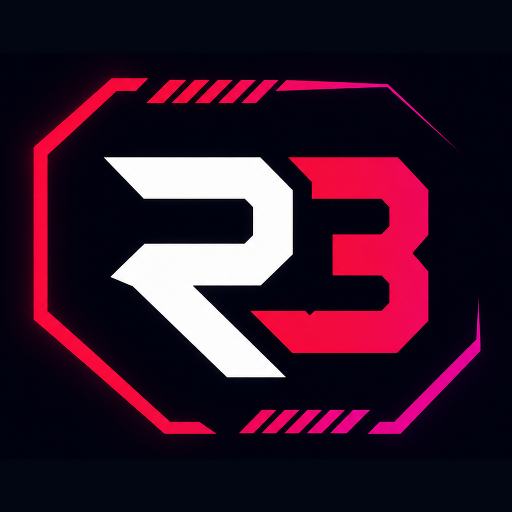

<div align="center">
  

# R3 Media Hub

**A desktop home for browsing, tracking, and playing movies, series, and anime.**

[](https://www.electronjs.org/)
[](https://react.dev/)
[](https://www.typescriptlang.org/)

</div>

R3 Media Hub is a cross-platform Electron application that brings discovery, watch history,
downloads, playback, and social viewing into one interface. Browse the catalog without an
account, then connect either TorBox or your own Jellyfin/download stack when you are ready to
play something. Optional metadata, tracking, and subtitle services add to the experience.

> [!IMPORTANT]
> R3 Media Hub does not provide media, a TorBox subscription, or a media server. You are
> responsible for the services and libraries you connect and for ensuring that your use of media
> complies with applicable law.

## At a glance

```text
 Discover a title        Choose how to watch          Keep everything organized
 ┌─────────────────┐     ┌─────────────────────┐      ┌────────────────────────┐
 │ Movies          │     │ Use best source     │      │ Continue watching      │
 │ Series          │ ──▶ │ Select an episode   │ ──▶  │ Watch history          │
 │ Anime           │     │ Pick audio/subtitles│      │ My Stuff & downloads   │
 └─────────────────┘     └─────────────────────┘      └────────────────────────┘
           │                         │                            │
           └──────────── Invite friends to a Watch Party ───────┘
```

### What it can do

- **Browse movies, series, and anime** with search, genre and status filters, title details,
  seasons, episodes, ratings, and recommendations.
- **Play from local files, a media server, or TorBox** with automatic source selection,
  audio-language preferences, playback buffering, subtitle selection, and resume progress.
- **Track what you watch** locally and, if desired, sync compatible activity with Simkl and
  MyAnimeList.
- **Build a personal library** in **My Stuff**, including watchlisted, liked, disliked, watched,
  and in-progress titles.
- **Manage downloads** and optionally connect Jellyfin, Sonarr, Radarr, and qBittorrent.
- **Watch together** over a direct LAN/WAN connection or an optional R3 Party Sync relay, with
  a shared queue and synchronized playback controls.
- **Use separate profiles**, including Kids and PIN-protected profiles. Watch history is
  currently shared between profiles.

## Quick start

### Install a release

Download the installer for your platform from the
[GitHub Releases page](https://github.com/R3v07v3R/r3v07v3r-media-hub/releases):

- **Windows:** NSIS setup executable
- **macOS:** DMG
- **Linux:** AppImage, Snap, or Debian package

Open R3 Media Hub after installation. The catalog is browsable immediately. For playback,
connect either a TorBox account or your own media/download services (Jellyfin, Sonarr, Radarr,
and qBittorrent).

### Connect a playback source and play your first title

1. Open **Settings** in R3 Media Hub.
2. Connect at least one playback source:
   - **TorBox:** copy the API token from your TorBox account settings, paste it into the
     **TorBox** section, and choose **Connect**; or
   - **Your own library/download stack:** configure Jellyfin and/or Sonarr, Radarr, and
     qBittorrent under **Media Servers & Downloads**, then save and test the connections.
3. Optional: under **Subtitles**, choose your preferred spoken-audio and subtitle languages.
4. Open **Movies**, **Series**, or **Anime**, select a title, and choose **Watch**.
5. For a show, select its season and episode first. R3 Media Hub remembers playback progress so
   you can continue later from Home or My Stuff.

The usual path through the app is:

```text
Settings → Connect TorBox OR your media/download services
                              ↓
Movies / Series / Anime → Title details → Watch → Best available source
                 ↓                              ↓
              My Stuff                  Continue Watching
```

When more than one source is connected, R3 Media Hub resolves playback in this order:

1. **Local content** already available on the device.
2. **Media-server content** available through your connected library services.
3. **Download streams** supplied through the connected download/TorBox services.

This means connecting TorBox alongside your own services does not bypass a local copy: the app
uses local content first, then checks the media server, and only then falls back to a download
stream.

## Using the app

| Destination   | What you will find there                                                                                         |
| ------------- | ---------------------------------------------------------------------------------------------------------------- |
| **Home**      | Featured picks, continue watching, recommendations, moods, and optional system-performance gauges.               |
| **Movies**    | Movie discovery and filtering. Select a card to see its synopsis, ratings, related titles, and playback actions. |
| **Series**    | TV discovery plus season and episode selection.                                                                  |
| **Anime**     | Anime discovery, season groupings, episode progress, and anime-specific tracking.                                |
| **My Stuff**  | Watchlist, liked/disliked titles, watched items, and viewing history.                                            |
| **Downloads** | Active and completed TorBox downloads with relevant actions.                                                     |
| **Settings**  | Playback, language, network, profiles, connected services, Watch Party, and updates.                             |

On desktop, press <kbd>Ctrl</kbd>+<kbd>B</kbd> (or <kbd>⌘</kbd>+<kbd>B</kbd> on macOS) to collapse
or expand the sidebar. On narrow windows, primary navigation moves to the bottom; use **More**
for Downloads and Settings.

### Optional service connections

Playback requires either **TorBox** or your own connected media/download services. Connecting
both is supported; the app applies the local → media server → download stream priority described
above. Metadata, tracking, subtitle, and relay services remain optional:

| Service             | Purpose                                                                              |
| ------------------- | ------------------------------------------------------------------------------------ |
| **TMDB**            | Richer artwork and metadata.                                                         |
| **OMDb**            | Additional movie and series ratings, including Rotten Tomatoes data where available. |
| **Simkl**           | Account-based watch tracking and catalog enrichment.                                 |
| **MyAnimeList**     | Anime list and progress synchronization.                                             |
| **SubDL**           | Search for and automatically apply subtitles, with no daily download limit.          |
| **OpenSubtitles**   | The same, from a second catalogue (a free account allows 5 downloads per day).        |
| **Jellyfin**        | Play content from an existing personal media library.                                |
| **Sonarr / Radarr** | Connect series and movie management to the local download workflow.                  |
| **qBittorrent**     | Supply and manage downloads for the local playback workflow.                         |
| **R3 Party Sync**   | Relay Watch Party traffic when a direct connection is not suitable.                  |

Add or remove these integrations from **Settings**. API credentials are entered in the desktop
app rather than in the source tree.

### Start a Watch Party

1. Open **Settings → Watch Party** and set your display name.
2. Choose direct hosting for a LAN/WAN party, or configure **R3 Party Sync** for relay mode.
3. Host a room and send its generated invite to the other viewers through a trusted channel.
4. Guests join with the invite. Participants can suggest titles and vote in the shared queue.
5. Start a queued title; play, pause, and seek events are synchronized for the room.

Direct hosting advertises your local network address and can attempt router port mapping. If
that is unavailable or undesirable, use the relay option instead. Treat party invites as secrets
while a room is active.

## Run from source

### Requirements

- [Node.js](https://nodejs.org/) 20 or newer
- npm (included with Node.js)
- Git
- Platform build tools if you intend to create an installer

```bash
git clone https://github.com/R3v07v3R/r3v07v3r-media-hub.git
cd r3v07v3r-media-hub
npm install
npm run dev
```

Useful project commands:

| Command               | Purpose                                                         |
| --------------------- | --------------------------------------------------------------- |
| `npm run dev`         | Start Electron with the Vite development server and hot reload. |
| `npm start`           | Preview an already-built application.                           |
| `npm test`            | Run the repository's focused test suite.                        |
| `npm run lint`        | Check JavaScript and TypeScript with ESLint.                    |
| `npm run typecheck`   | Type-check both Electron/Node and renderer projects.            |
| `npm run build`       | Type-check and produce the Electron application bundles.        |
| `npm run build:win`   | Create a Windows installer.                                     |
| `npm run build:mac`   | Create a macOS package.                                         |
| `npm run build:linux` | Create Linux AppImage, Snap, and Debian packages.               |

### Architecture

```text
src/
├── main/                 Electron main process
│   ├── ipc/              Validated IPC endpoints
│   └── media-hub/        Catalog, playback, services, tracking, and parties
├── preload/              Narrow renderer-to-main bridge
├── renderer/             React user interface
└── shared/               Types and logic shared across process boundaries

React renderer ──validated IPC──▶ Electron main ──HTTPS / WebSocket──▶ services
       ▲                              │
       └──────── local playback ◀─────┘
```

The renderer does not receive direct Node.js access. Service calls, credential storage, local
playback proxying, and Watch Party networking are handled in the Electron main process and
exposed through the preload bridge.

## Troubleshooting

<details>
<summary><strong>The catalog opens, but a title will not play</strong></summary>

Confirm that at least one playback path is connected. For TorBox, check that **Settings →
TorBox** says **Connected** and reconnect if the token was revoked or expired. For your own
stack, test the Jellyfin, Sonarr, Radarr, and qBittorrent connections under **Media Servers &
Downloads** and confirm the requested title exists or can be obtained. If several sources are
connected, remember that R3 Media Hub checks local content first, media-server content second,
and download streams last.

</details>

<details>
<summary><strong>Subtitles do not appear automatically</strong></summary>

Enable **Show subtitles automatically**, choose the correct subtitle language, and connect
SubDL and/or OpenSubtitles in Settings. You can still open the playback subtitle menu and search
manually.

Both providers are searched together and the results are shown in one list, tagged with the
service each came from. SubDL is listed first because its downloads are unmetered, so the
automatic fetch prefers it; OpenSubtitles allows only 5 downloads per day on a free account. If
the menu says "No results", check that at least one of the two is still connected.

</details>

<details>
<summary><strong>A Watch Party guest cannot connect</strong></summary>

For direct hosting, first try the same LAN and verify that local firewall rules allow the app.
WAN hosting additionally depends on router/NAT behavior. Configure R3 Party Sync and use relay
mode when direct connectivity is unavailable.

</details>

<details>
<summary><strong>A media-server connection test fails</strong></summary>

Check the server URL, credentials/API key, and whether the server is reachable from this machine.
Use the full base URL, including `http://` or `https://` and a non-default port when needed.

</details>

## Security and privacy

- Keep API keys, account credentials, and Watch Party invitations private; never commit them to
  the repository.
- Prefer HTTPS for remote service connections.
- Review the project's [security review](docs/SECURITY_REVIEW.md) for the current trust model,
  controls, and known limitations.
- Report security issues privately to the maintainer rather than opening a public issue with
  sensitive details.

## Contributing

Issues and focused pull requests are welcome. Before submitting a change, run:

```bash
npm test
npm run lint
npm run typecheck
```

Please keep credentials and generated build output out of commits. This repository uses Prettier,
ESLint, and TypeScript for consistency.

---

<div align="center">
  Built with Electron, React, and TypeScript.
</div>
